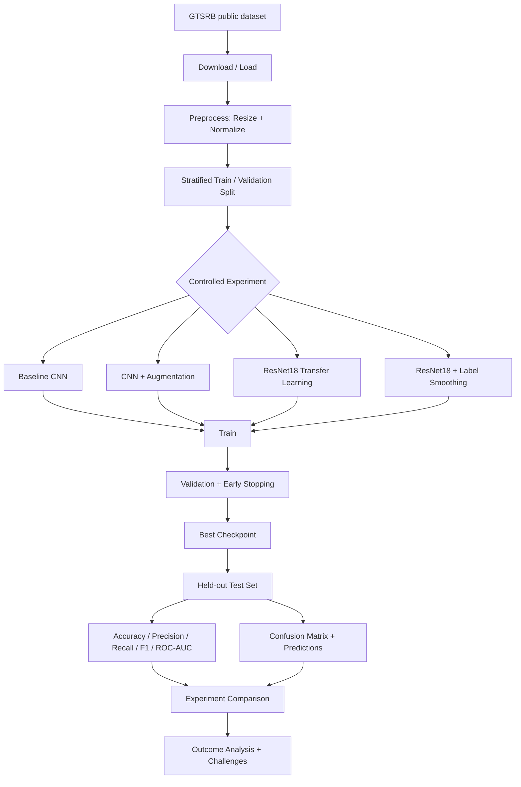

# Experiment Workflow Diagram

```mermaid
flowchart TD
    A[GTSRB public dataset] --> B[Download / Load]
    B --> C[Preprocess: Resize + Normalize]
    C --> D[Stratified Train / Validation Split]
    D --> E{Controlled Experiment}
    E --> E1[Baseline CNN]
    E --> E2[CNN + Augmentation]
    E --> E3[ResNet18 Transfer Learning]
    E --> E4[ResNet18 + Label Smoothing]
    E1 --> F[Train]
    E2 --> F
    E3 --> F
    E4 --> F
    F --> G[Validation + Early Stopping]
    G --> H[Best Checkpoint]
    H --> I[Held-out Test Set]
    I --> J[Accuracy / Precision / Recall / F1 / ROC-AUC]
    I --> K[Confusion Matrix + Predictions]
    J --> L[Experiment Comparison]
    K --> L
    L --> M[Outcome Analysis + Challenges]
```
